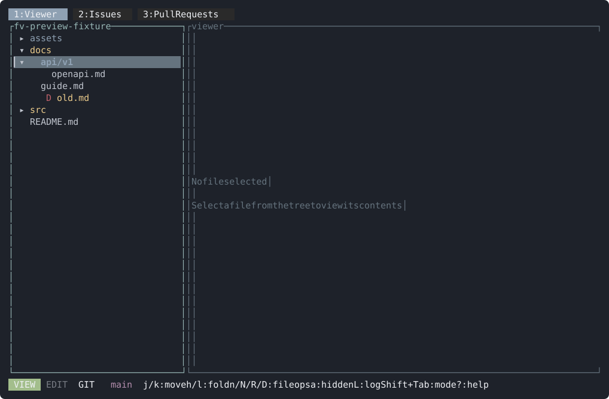
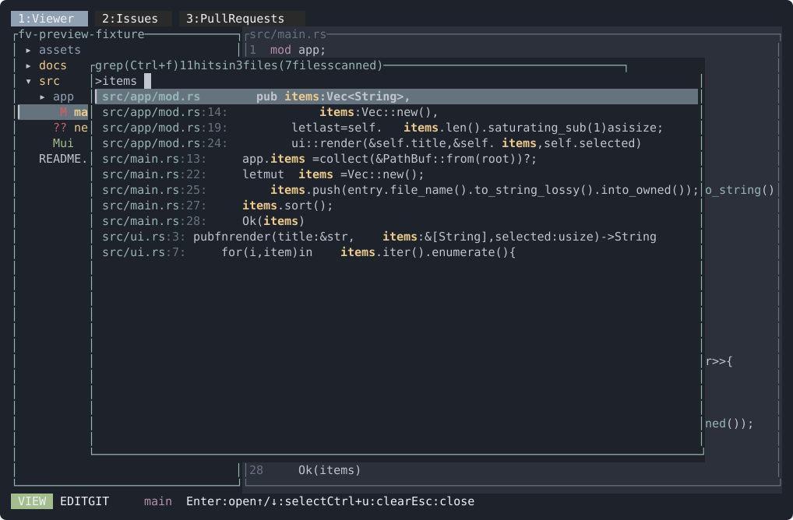
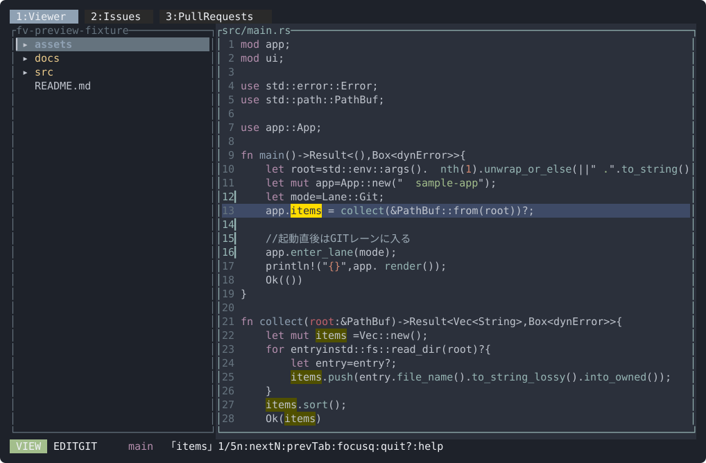
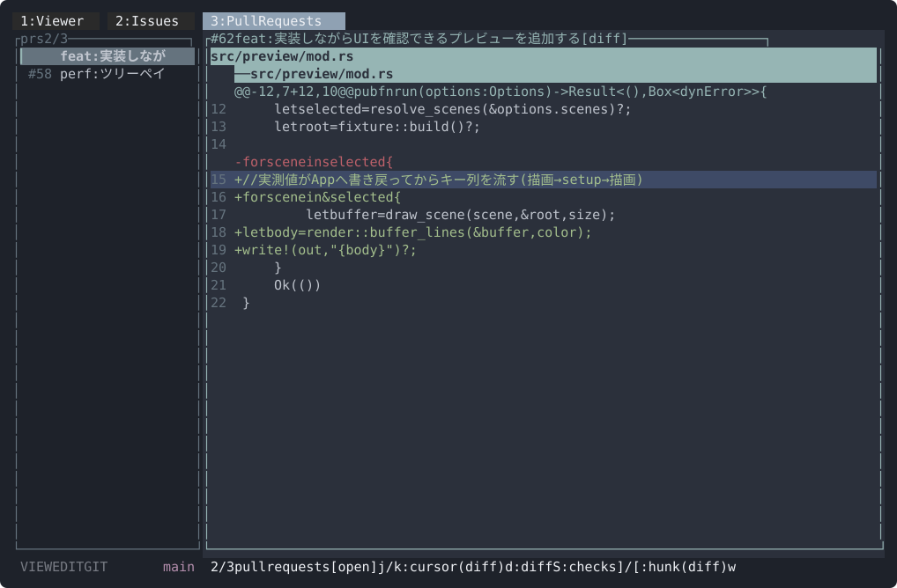

# UI preview gallery

<!-- UI スクリーンショットテストの成果物そのもの。`cargo preview --update-snapshots` が焼き直すので手で貼り替えない -->

`cargo preview <scene>`（使い方は末尾の「UI previews」）が描き出す全シーンの一覧。
各画像は `docs/preview/<scene>.svg` として commit 済みで、CI が毎 PR で再描画して突き合わせる。

## VIEW レーン

| | |
| --- | --- |
| **tree** — ツリーだけ (ファイル未選択) | **view** — VIEW レーン: ファイルを開いた既定の画面 |
|  |  |
| **wrap** — 折返し表示 (`w`) — 続き行の gutter pad | **view-binary** — 非テキストファイルのフォールバック |
|  |  |
| **search** — 検索ハイライトと `n`/`N` の状態 | **narrow** — 狭い端末 (列が落ちる閾値の確認) |
|  |  |
| **select** — 行単位の範囲選択 (`v` → `j`) とコピーのヒント | **tree-ignored** — `i` で `.gitignore` 対象も表示 (暗色) |
|  |  |
| **tree-chain** — 子がディレクトリ 1 つだけの階層は 1 行に畳んで 1 回で開く (`docs/api/v1`) | |
|  | |

## EDIT レーン

**edit** — カーソル + 未保存バッファのライブ diff


## GIT レーン

| | |
| --- | --- |
| **git** — 単一ファイルの inline diff (word-level 強調) | **git-side** — side-by-side diff |
|  |  |
| **git-all** — 全ファイルまとめ diff (sticky header 付き) | **git-lines** — 行カーソルと `V` の行単位選択 (`Enter` で行だけ stage) |
|  |  |
| **confirm** — `X` 破棄の確認オーバーレイ | |
|  | |

## LOG レーン

**log** — コミット一覧 + 選択コミットの diff


## オーバーレイ

| | |
| --- | --- |
| **finder** — `Ctrl+p` ファジーファインダー | **help** — `?` ヘルプオーバーレイ |
|  |  |
| **settings** — `s` 設定オーバーレイ | **commit** — `c` コミットメッセージ入力 (50/72 桁ルーラー付き) |
|  |  |
| **branch** — `b` ブランチ一覧オーバーレイ | **grep** — `Ctrl+f` ワークスペース横断検索 (走査完了後) |
|  |  |
| **grep-jump** — grep のヒットを Enter で開いた直後 | |
|  | |

## GitHub モード

| | |
| --- | --- |
| **issues** — issues タブ | **prs** — pull requests タブ |
|  |  |
| **prs-diff** — pull requests タブ: 差分表示 (`d`) と行カーソル | |
|  | |

---

シーンの定義は `src/preview/scene.rs`。焼き直しは `cargo preview --update-snapshots`（1 シーンだけなら
`cargo preview <scene> --update-snapshots`）。仕組みの詳細は下の「UI screenshot tests」、設計上の判断は [docs/design/preview.md](../design/preview.md) を参照。

## UI previews

Like Jetpack Compose `@Preview` or SwiftUI previews, you can render a single frame of any
screen straight to stdout — no need to launch the TUI and click your way to the state you
are working on:

```sh
cargo preview                      # list the available scenes
cargo preview git                  # render one scene
cargo preview git log commit       # render several, stacked
cargo preview all --size 140x40    # everything, at a specific terminal size
```

`cargo preview` is an alias for `cargo run --features preview -- --preview`. The preview is a
dev-only feature: it is off by default, so released binaries contain no preview code and do not
accept `--preview`.

Every scene runs against a throwaway sample repository (created under `$TMPDIR`) that always
has staged, unstaged, untracked and deleted files plus a few commits, so the output does not
depend on the state of your working tree. Scenes are built by feeding real key presses to the
app, and rendered by the same `shell::draw` the real terminal uses — there is no preview-only
drawing path.

For the edit-and-look loop, re-render on every save:

```sh
scripts/preview-watch.sh git      # rebuilds and redraws whenever src/ changes
```

Add a scene in `src/preview/scene.rs`; a scene is a name, a description and a key script.

## UI screenshot tests

Every scene is also committed as an image under `docs/preview/`, and CI re-renders all of them on
every PR. The images *are* the snapshots — there is no separate text form. Since they are SVG,
GitHub renders them: the diff shows up as a before/after picture in Files changed, and a bot
comment lays each changed scene out as **before | diff | after**, so an unintended UI regression
is something you can actually see.

The middle panel comes from [shotdiff](https://github.com/Matuyuhi/shotdiff) (`--diff-only`),
which paints every changed pixel pink — you spot the change without comparing two full screens by
eye. Its `diff` and `after` are rendered by that CI run rather than read from the commit, so the
comment shows the current drawing even when the committed images have not been refreshed yet.
Neither file exists in the repository, so they are published to a history-less orphan branch
(`ci-ui-diff`) and referenced by commit SHA — a branch name would let GitHub's image proxy serve
a stale picture forever.

```sh
cargo preview --update-snapshots        # re-render every scene into docs/preview/
cargo preview view --update-snapshots   # just one
```

Volatile values (commit SHAs, absolute dates) are masked while keeping their column width, so the
images stay byte-identical between runs and still read as screenshots. Masking happens on the
rendered buffer rather than on text, because the image carries per-cell colour too: the style
boundary left by a shorter date would otherwise move even after the text was padded back to a
fixed width.

SVG rather than PNG because it needs no rasteriser (and therefore no new dependency), it carries
no fonts of its own — so the Japanese text in the sample repository renders with the reader's
fonts rather than as tofu — and it is text, so it lives in git history like any other file.
Columns are held by giving every glyph its own `x`, the way a terminal puts characters on a grid;
relying on the viewer's font advance would drift across a 110-column line.

A stale image never fails a PR: the committed files are refreshed automatically by a bot commit
once the change lands on `main`. Refresh them yourself if you want the UI change to show up in
your own PR — and the screenshot at the top of the top-level README, which is `view.svg` here, to
match your branch.
